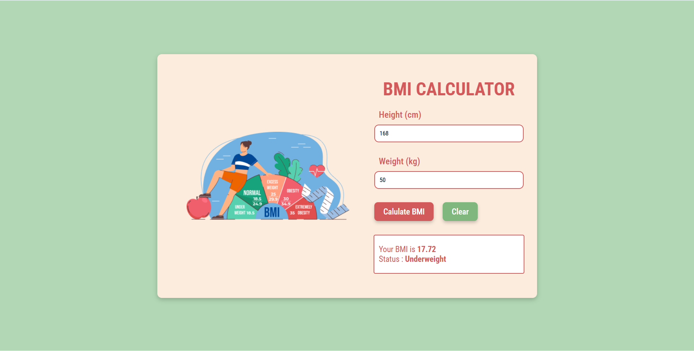

# React BMI Calculator

A BMI Calculator built with **React**.  
It allows users to know about their **Body Mass Index (BMI)**.

## 🚀 Features
- Gives the user their BMI
- BMI Status
- Built with **React Hooks**

  ## 📸 Preview


## 🛠️ Technologies Used
- **React.js**  
- **JavaScript**  
- **HTML5**  
- **CSS3**  
- **Vite**
- **Prettier**
  
  ## 📦 Installation
```bash
git clone https://github.com/osvi-25/react-bmi-calculator.git
cd react-bmi-calculator
npm install
npm start
```
## 🧑‍💻 Usage

1. **Enter** your height and weight in the input field.
2. **Click Calculate BMI** to know about your BMI and BMI Status.
